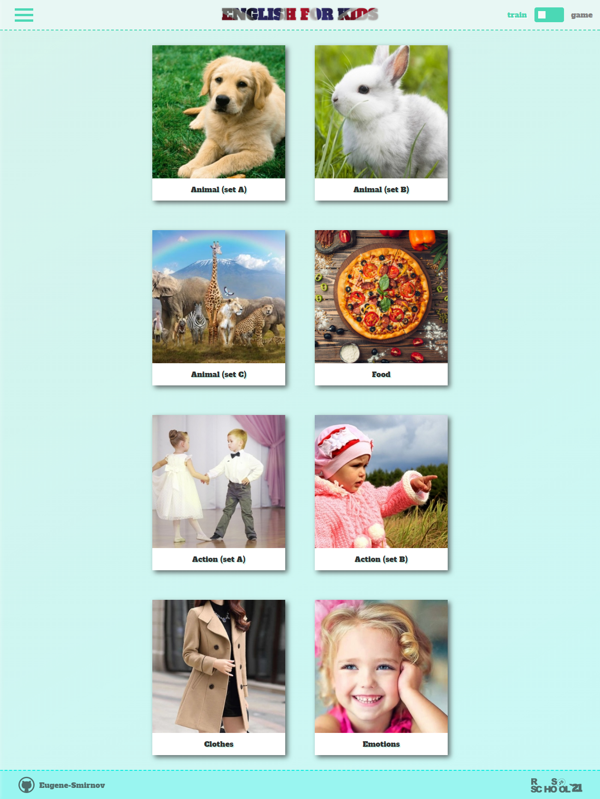
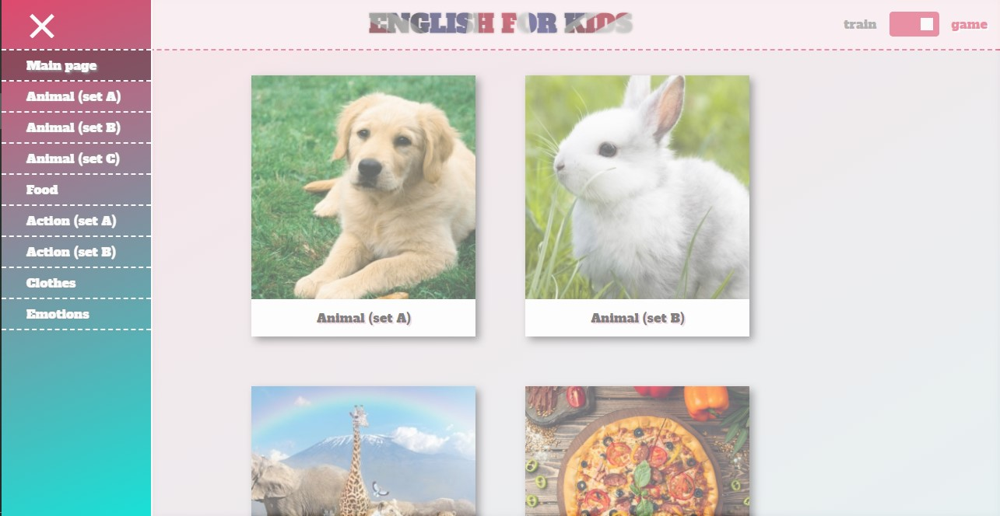
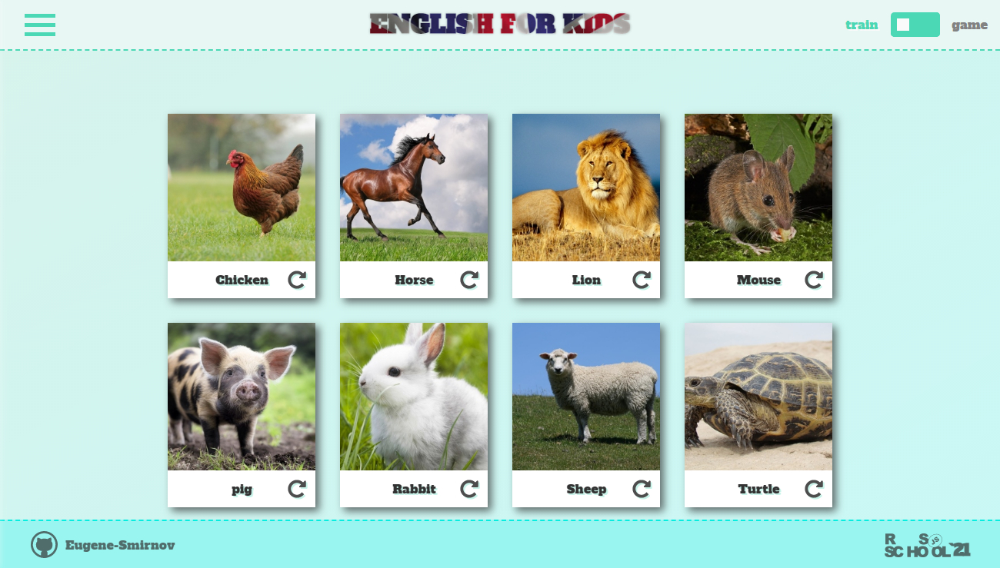
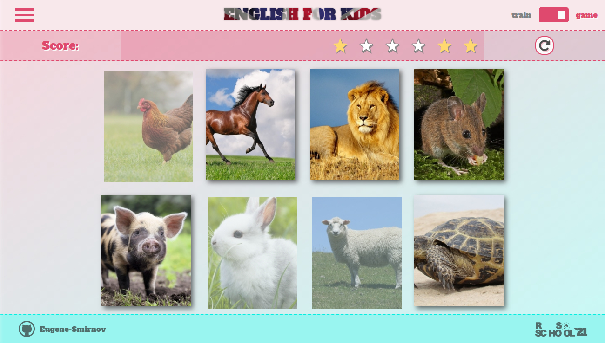

## English for kids

###### by Eugene-Smirnov

1. Task: https://github.com/rolling-scopes-school/tasks/blob/master/tasks/rslang/english-for-kids.md
2. Screenshots:

3. Deploy: https://eugene-smirnov-english-for-kids.netlify.app/
4. Done 07.07.2021 / Deadline 08.07.2021
5. Score: 310 / 360

### Cross-check review

Task implemented in accordance with **[requerments](https://github.com/rolling-scopes-school/tasks/blob/master/tasks/rslang/english-for-kids.md#%D0%BA%D1%80%D0%B8%D1%82%D0%B5%D1%80%D0%B8%D0%B8-%D0%BE%D1%86%D0%B5%D0%BD%D0%BA%D0%B8)** fully.
Hacker scope with statistics page wasn't implemented (-50).
**Total: 310**
