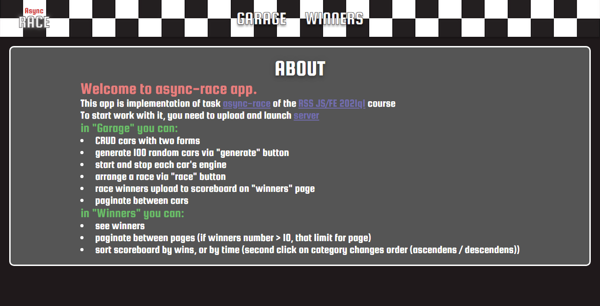
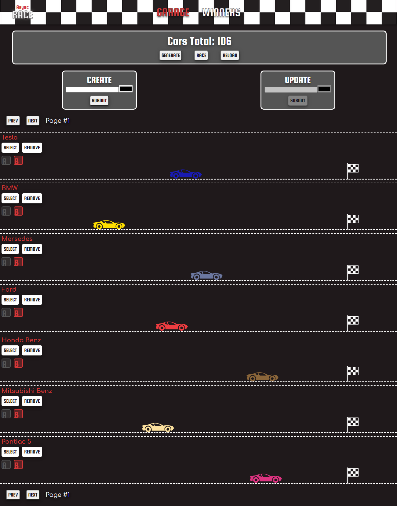
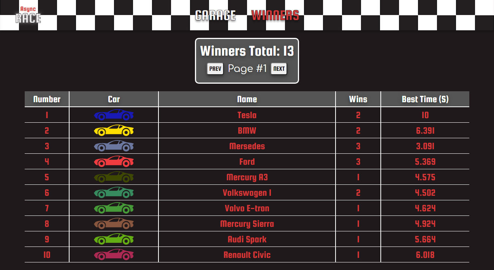

## Async RACE

###### Rolling Scopes School JS/FE 2021q1

###### by Eugene-Smirnov

1. Task: https://github.com/rolling-scopes-school/tasks/blob/master/tasks/async-race.md
2. Screenshots:

3. Deploy: https://eugene-smirnov-async-race.netlify.app/
4. Done 11.06.2021 / Deadline 14.06.2021
5. Score: 340 / 340

### Cross-check review

Task implemented in accordance with **[functional requerments](https://github.com/rolling-scopes-school/tasks/blob/master/tasks/async-race.md#functional-requirements)** fully.
**Total: 190**

### Menthor's review

Task implemented in accordance with **[non-functional requerments](https://github.com/rolling-scopes-school/tasks/blob/master/tasks/async-race.md#non-functional-requirements)** fully.
**Total: 150**
