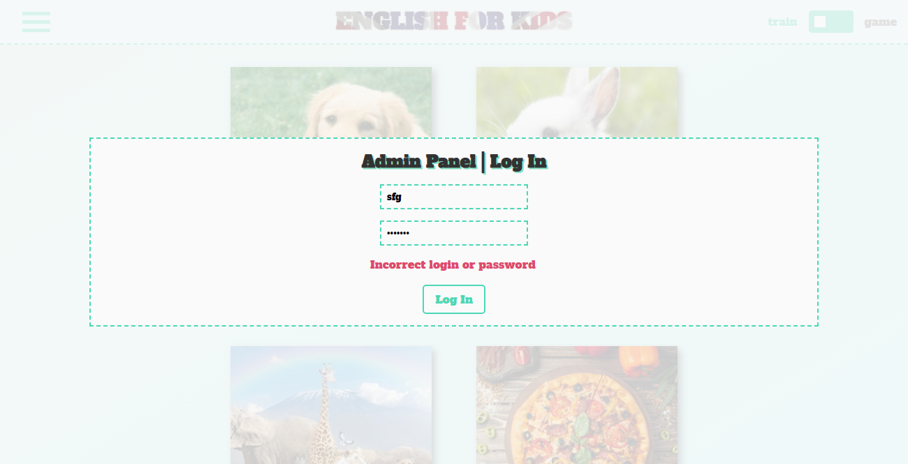
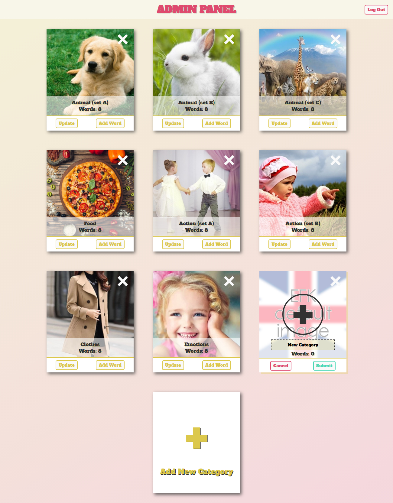
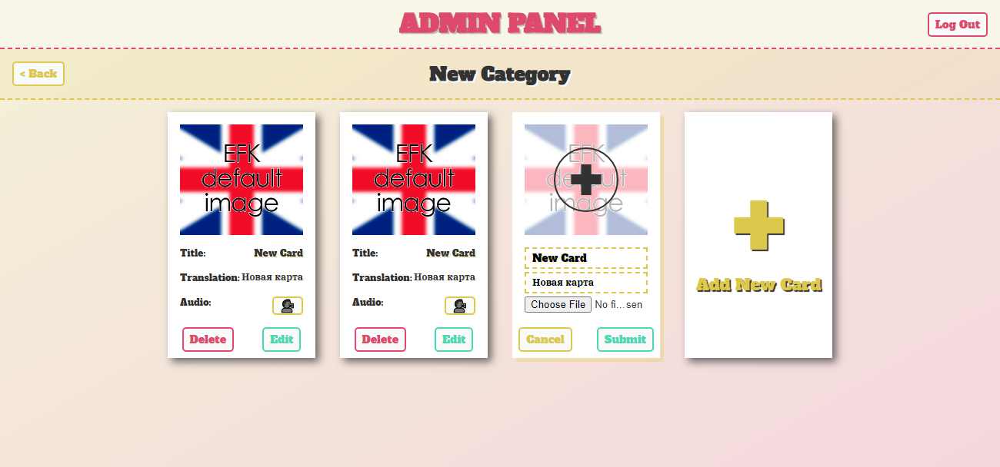
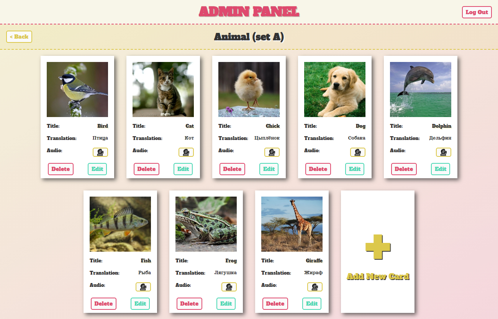

## English for kids - Admin panel and Express server

###### by Eugene-Smirnov

1. Task: https://github.com/rolling-scopes-school/tasks/blob/master/tasks/rslang/english-for-kids-admin-panel.md
2. Screenshots:

3. Deploy: https://eugene-smirnov-english-for-kids.netlify.app/admin
4. Done 15.07.2021 / Deadline 16.07.2021
5. Score: 325 / 385

### Cross-check review

Task implemented in accordance with **[requerments](https://github.com/rolling-scopes-school/tasks/blob/master/tasks/rslang/english-for-kids-admin-panel.md#%D0%BA%D1%80%D0%B8%D1%82%D0%B5%D1%80%D0%B8%D0%B8-%D0%BE%D1%86%D0%B5%D0%BD%D0%BA%D0%B8)** practically full, exept:
-15 - Реализован infinite scroll для категорий. **(not realized)**
-15 - Реализован infinite scroll для слов. **(not realized)**
-10 - присутствует swagger с возможностью делать запросы к api. **(not realized)**
-20 - Данные хранятся в базе данных. **(not realized)**
**Total: 325**
