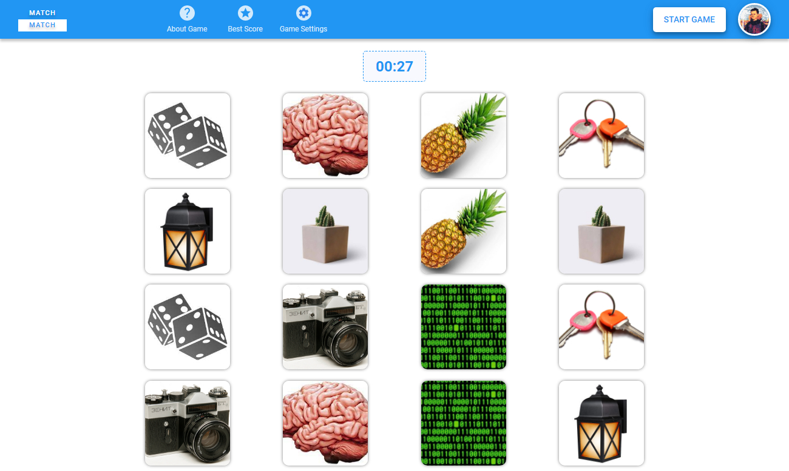

## Match-Match | Game

###### Rolling scopes school JS\FE 2021q1

###### by Eugene-Smirnov

1. Task: https://github.com/rolling-scopes-school/tasks/blob/master/tasks/match-match-game.md
2. Screenshot:

3. Deploy: https://eugene-smirnov-match-match.netlify.app/
4. Done 31.05.2021 / Deadline 31.05.2021
5. Score: 160 / 160

### Cross-check review

+10 - Верстка содержит все описанные в требованиях блоки  
+20 - Соблюдены все требования к валидации полей для регистрации игрока в приложении.  
+20 - Реализован игровой цикл.  
+10 - Реализована таблица рекордов.  
+10 - Реализована страница settings.  
+10 - Реализована страница about game.  
+30 - Задание повышенной сложности добавление аватарок.
**Итого: 110**

### Проверка задания ментором

+10 - Приложение разбито на отдельные логические модули/слои, повторяющиеся части вынесены в shared.  
+10 - В приложении отсутствую магические цифры и строки.  
+10 - Методы и функции не превышают 100 строк.  
+10 - Имена переменных и функций четко говорят о содержащихся в них данных  
+10 - Дублирование кода (Функций и методов) сведено к минимуму  
**Итого: 160**
